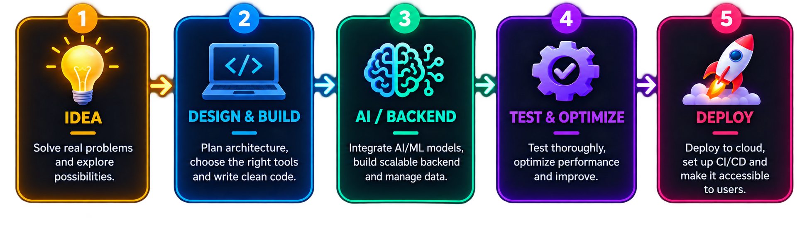

<!-- ===================== HERO SECTION ===================== -->

<div align="center">

# 👋 Hey, I'm **Raj Kumar Pegu**

### `AI/ML Engineer` • `Backend Developer` • `Electronics & Instrumentation Engineer`


<br>

<a href="https://github.com/Kamalpegu">

</a>

<a href="https://github.com/Kamalpegu?tab=followers">

</a>

<a href="https://github.com/Kamalpegu">

</a>

</div>

---

<!-- ===================== ABOUT ===================== -->

## 🧑‍💻 About Me


I'm an **Electronics & Instrumentation Engineering student at NIT Silchar** who enjoys building systems at the intersection of:

**🤖 AI + ⚡ Backend + 🌐 Web + 🧠 ML + 🔧 Hardware**

- 🔭 Currently working on **Pod AI** & **Blind Navigator**
- 🤖 Building AI-powered applications with **Gemini & Python**
- ⚡ Interested in **FastAPI, Django, WebSockets & concurrent systems**
- 🧵 Exploring **multithreading, queues & distributed architectures**
- ♿ Interested in **accessibility-focused technology**
- 🌱 Currently learning **Go (Golang)**
- ☁️ Preparing for **Google Cloud Digital Leader**
- 🏆 **2nd Runner Up — Neurathon Hackathon**
- 💬 Ask me about **Python, FastAPI, Django, AI, Gemini, WebSockets & Multithreading**

<br clear="right"/>

---
<!-- ===================== DEVELOPER PHILOSOPHY ===================== -->

<h2 align="center">🧠 My Developer Philosophy</h2>

<p align="center">
  
</p>

<p align="center">
  <i>I don't just learn technologies — I try to build something with them.</i>
</p>

<br>
# 🚀 Featured Projects

<div align="center">

## 🎙️ Pod AI

### AI-Powered Interactive Podcast Agent


</div>

**Pod AI** is an AI-powered interactive podcast system where users can interact with AI-generated podcast conversations.

### 🔥 What I Built

- 🤖 Integrated **Gemini** for AI conversation generation
- 🎙️ Implemented **Speech-to-Text**
- 🔊 Implemented **Text-to-Speech**
- 🧵 Designed a **queue-based concurrent architecture**
- ⚡ Used **multithreading** for independent workloads
- 🗄️ Added **Redis caching & task management**
- 🚀 Built backend APIs using **FastAPI**
- ⚛️ Connected the backend with a **React frontend**
- 🏗️ Designed the architecture for future scalability

<h2>🎙️ Pod AI — AI-Powered Interactive Podcast Agent</h2>

<p>
  An AI-powered interactive podcast system...
</p>

<!-- your existing Pod AI details -->

<h3 align="center">🧩 Architecture</h3>

<p align="center">
  
</p>

<br>

---

<div align="center">

## ♿ Blind Navigator

### Assistive Accessibility Web Application


</div>

**Blind Navigator** is an accessibility-focused application designed to provide visually impaired users with voice-oriented navigation and audio feedback.

### 🔥 What I Built

- 🗣️ Voice-oriented interaction
- 🔊 Audio feedback system
- 🌐 Lightweight browser interface
- 📍 Geospatial/navigation workflows
- 🗺️ Route-processing concepts
- 🚀 Production deployment
- ⚙️ WSGI configuration
- 🐍 Python virtual-environment setup
- 🧠 Architecture prepared for future computer vision

<!-- ===================== FUTURE VISION ===================== -->

<h3 align="center">🔮 Future Vision</h3>

<p align="center">
  
</p>

<br>


---

<div align="center">

## 🫁 AeroDX

### Lung Disease Detection using Deep Learning


</div>

A deep-learning project focused on detecting pulmonary diseases from medical images.

### 🔥 What I Worked On

- 🧠 CNN-based classification
- 🔄 Transfer Learning
- 🏗️ ResNet-based approaches
- ⚡ EfficientNet experimentation
- 🖼️ Image preprocessing
- 📊 Dataset preparation
- 🧪 Model evaluation
- 🌐 API-based inference
- 🚀 Flask/FastAPI model serving

```text
Medical Images
      ↓
Preprocessing
      ↓
Data Augmentation
      ↓
CNN / Transfer Learning
      ↓
Model Training
      ↓
Evaluation
      ↓
API Inference
```

---

<div align="center">

## 🔐 SafeSearch

### Malicious URL Detection


</div>

A Streamlit-based URL security checker using the **VirusTotal API**.

### 🔥 What I Worked On

- 🔗 URL analysis
- 🛡️ VirusTotal API integration
- 🌐 Streamlit frontend
- 📊 Security result visualization
- ⚡ Simple security-analysis workflow

---

<div align="center">

## 📊 Flipkart Sales Analytics


</div>

Interactive sales analytics dashboard built to transform raw data into useful business insights.

### 🔥 What I Worked On

- 📥 Data cleaning
- 🐼 Pandas-based analysis
- 📊 Exploratory Data Analysis
- 📈 Interactive Plotly visualizations
- 🌐 Streamlit dashboard
- 🔎 Trend and pattern analysis

---

<div align="center">

## 💬 Real-Time Chat Application


</div>

Real-time communication application built using **Django Channels and WebSockets**.

### 🔥 What I Worked On

- 🔄 Bidirectional WebSocket communication
- 💬 Real-time messaging
- 🧵 Asynchronous communication
- 🗄️ Redis channel layer
- 🌐 Django backend
- ⚡ Persistent real-time connections

---

# 🧰 Tech Stack

## 👨‍💻 Languages

<p>

</p>

## 🤖 AI / ML

<p>

</p>

**Also working with:**

`Gemini` `LLMs` `NLP` `Computer Vision` `Transfer Learning` `Generative AI`

## ⚙️ Backend

<p>

</p>

`REST APIs` `WebSockets` `Django Channels` `Multithreading`

## 🗄️ Databases

<p>

</p>

## 🌐 Frontend

<p>

</p>

## ☁️ Cloud / DevOps

<p>

</p>

---

# 🧠 What I'm Currently Exploring

<div align="center">

### `Go` → `Concurrency` → `Distributed Systems` → `Cloud Architecture` → `Scalable AI`

</div>

I'm currently exploring how to build applications that are not only functional but also:

**⚡ Fast**

**🔄 Concurrent**

**📈 Scalable**

**🛡️ Reliable**

**☁️ Cloud-ready**

---

# 🏆 Achievements

<div align="center">

| 🏆 Achievement | 📌 Details |
|---|---|
| 🥉 Hackathon | **2nd Runner Up — Neurathon Hackathon** |
| 🎓 Education | **B.Tech — Electronics & Instrumentation Engineering, NIT Silchar** |
| 🧠 Certification | **Machine Learning with Python — freeCodeCamp** |
| ☁️ Learning | **Google Cloud Digital Leader — In Progress** |

</div>

---

# ⚡ Fun Facts

```text
🔧 Electronics & Instrumentation
            +
🤖 Artificial Intelligence
            +
🐍 Python Backend
            +
⚡ Real-Time Systems
            =
🚀 Me
```

- 🔌 Electronics student who spends a lot of time building software.
- 🤖 I enjoy turning AI ideas into actual applications.
- 🧠 I like understanding systems **under the hood**.
- 🧵 Fascinated by concurrency and multithreading.
- 🎙️ Built an interactive AI podcast system.
- ♿ Interested in accessibility technology.
- 🫁 Worked on AI-based medical imaging.
- 🔧 My interests range from instrumentation to LLMs.
- 🏆 **2nd Runner Up at Neurathon Hackathon.**
- 🌱 Currently learning Go.
- 🚀 I enjoy taking unfinished ideas and turning them into working products.

---

# 📊 GitHub Analytics

<div align="center">


</div>

<br>

<div align="center">


</div>

---

# 🐍 Contribution Snake

<div align="center">


</div>

---

# 🌐 Connect With Me

<div align="center">

<a href="https://www.linkedin.com/in/raj-kumar-pegu-788819246/">

</a>

<a href="mailto:rajpegu894@gmail.com">

</a>

<a href="https://github.com/Kamalpegu">

</a>

</div>

---

<div align="center">

### 💭 "Build. Break. Learn. Improve. Repeat."

### 🚀 Always building something new.


</div>
